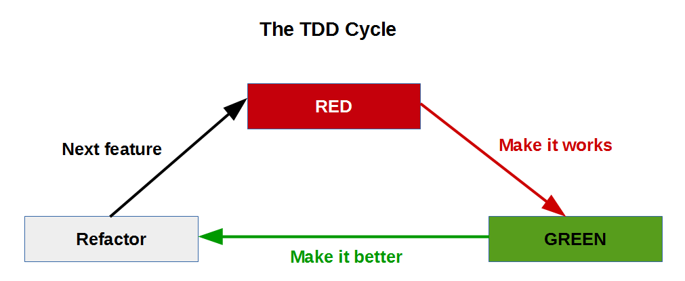

# Si le TDD est mort, alors pratiquons une autopsie

## Speaker(s)
Les 2 présentateurs étaient Bruno Boucard et Thomas Pierrain.

* Bruno Boucard
  - Twitter : https://twitter.com/brunoboucard
  - SlideShare : http://fr.slideshare.net/brunoboucard
* Thomas Pierrain
  - Blog : http://tpierrain.blogspot.fr/
  - Twitter : https://twitter.com/tpierrain
  - SlideShare : http://fr.slideshare.net/ThomasPierrain

## Notes

### Another shot
La pratique du TDD a pu décevoir certains ou peut sembler en perte de vitesse. Néanmoins
elle mérite qu'on si (ré-)intéresse et qu'on la ré-essaie le cas échéant. En effet le TDD est :
* _Reassuring_ (Rassurant)
  - pas de paralysie de l'analyse
* _Efficient_ (efficace)
  - YAGNI (You Ain't Gonna Need It)
* _Encouraging_ (encourageant)
  - Une journée de développement est souvent truffée de _feedbacks_ négatifs.
  - Un peu de _feedbacks_ positifs cela fait du bien.
* code Kata
  - principe se mettre une difficulté au travers d'un TDD
* coding Dojo
  - code kata à plusieurs -> TDD à plusieurs

Pour rappel, le schéma ci-après rappelle le cycle de fonctionnement de la TDD.

### Thinking out of the box

* Florence à l'aube de la Renaissance
  - artisans, _craftsmen_
  - Michel-Ange/Michelangelo
    - _Design_ émergent
    - _feels his nascent character through the stone_
      - Michelangelo a été mis dans une famille nourricière de _stonemasons_
      - Il apprend à tailler la pierre avant de savoir lire et écrire
      - Laurent de Médicis le prend sous son aile.
      - _a crazy workaholic_
  - Le lien avec le TDD ? L'approche TDD permet d'avoir un _design_ émergent.
* Règle des 10KHrs (_The 10KHrs-rule_)
  - Il faut passer 10Khrs dans un sujet pour en devenir un expert
  - _workouts impact our brain_
    - Développement _d'autoroute_ dans le cerveau
    - Un peu comme une _hotspot optimization_ ou la compilation du code interprété!
  - mais pourtant la répétition c'est aliénant !
    - Penser au film **Les Temps Modernes** de Charlie Chaplin
    - Distinguer la répétition stupide (un gest répété vide de sens) de l'entraînement.
    - Faire le lien avec le principe _Shu-Ha-Ri_

1. la préparation, c'est le SHOULD.
  - C'est ce que le traitement DOIT faire.
  - La base du test est le SCENARIO, le COMPORTEMENT
2. Le ralentissement
  - Lire _Thinking fast and fload_

### Retour d'expérience d'un des speaker

* avant de penser au test SHOULD de SCENARIO :
  - sur de 2,3 ans les tests ont bien marché puis il y a eu un gros blocage sur un gros projet.
  - Trop de tests, trop de retouches de tests...
    - donc les tests étaient mal écrits.
    - Les TU étaient liés à l'implémentation.
* Il faut donc tester le comportement, c'est le contrat d'interaction.
  - par exemple, tester des méthodes privées (quand c'est possible ou quand on y arrive), c'est du détail de l'implémentation.
  - Il s'agit donc de tester les méthodes publiques, les points d'entrée.
